# Distributed delta-stepping algorithm for single-source shortest path problem

Code presented here implements the techniques from the paper "Scalable Single Source Shortest Path Algorithms for Massively Parallel Systems". We provide comprehensive testing machinery for correctness at edge cases,
stress testing the limits of your hardware and random average-case tests for performing benchmarks and measuring weak-scaling for code with and without the different optimizations.

## Data generation: Graph500 distribution
We facilitate experiments on graphs generated in the same way as in the Graph500 benchmark.  
We use the reference implementation: https://github.com/graph500/graph500  
I was unable to compile this on my local machine or on the `students` server at MIMUW.  
Fortunately, it works on Okeanos.

Significant effort is required to turn the generated data into meaningful tests.  
I provide a C++ program to split the graph data into input files in our format.  
Additionally, using a reference Dijkstra implementation (via NetworkX in Python),  
we can compute optimal distances for smaller instances.

However, the generated graphs are:
- disconnected
- contain multi-edges
- contain self-loops

These cases must be properly handled by the distributed SSSP program.

The code for this section is in the `generate-graph500-rmat1-rmat2` directory.

## Data generation: Huge cycles
To test the behavior of the program on instances with a huge number of vertices and large edge weights (but still sparse), we provide a generator in the `generate-huge-cycle` directory.  
It creates a valid input consisting of a large cycle-graph with small random weights, except one edge with weight equal to `int64_t::max() - sum of other edges`.  
This tests the behavior of the program when the total weight sum approaches the numerical limit

## Data generation: Random connected graphs
As we initially wanted to focus only on connected graphs—and most naive random graph generators produce disconnected ones—we generate an `n`-ary tree using NetworkX, then randomly add edges between existing nodes.  
These are the "nicest" tests: no self-loops, no multi-edges, always connected, and with clearly defined vertex and edge counts.

## Hardware
At ICM, Okeanos has 1084 computational nodes.  
It is a Cray XC40 system with a Cray Aries network using dragonfly topology.  
Each node has:
- 24 cores (2x 12-core Intel Xeon E5-2690 v3 Haswell)
- 128GB of RAM  
- hyperthreading x2 (possible)  
- Lustre file system  
- SUSE Linux Enterprise Server  
- SLURM queue system 

# Correctness
We thoroughly verified correctness.  
Both the unoptimized (plain delta-stepping) and optimized versions were tested against RMAT-1 and RMAT-2 graphs, as well as random connected trees of the following configurations:

### RandomTree Configurations

| Arity | Height | Nodes (approx) | NProc       | EF   | Repeats     |
|-------|--------|----------------|-------------|------|-------------|
| 2     | 10     | ~1023          | 5           | 2–16 | —           |
| 2     | 15     | ~32,767        | 768         | 2    | ×10 seeds   |
| 3     | 6      | ~1093          | 5           | —    | ×10 seeds   |
| 2     | 7      | ~255           | 1–42        | 2    | —           |
| 3     | 9      | ~9841          | 768         | 10   | ×10 seeds   |

# Tuning
We evaluated different values of Delta to analyze execution time and total number of relaxations.  
With high Delta (Bellman-Ford style), the number of relaxations grows quickly.  
With Delta = 1 (Dijkstra-style), execution time grows fast at scale.  
We found Delta = 10 to be the best compromise, and use it as the default.

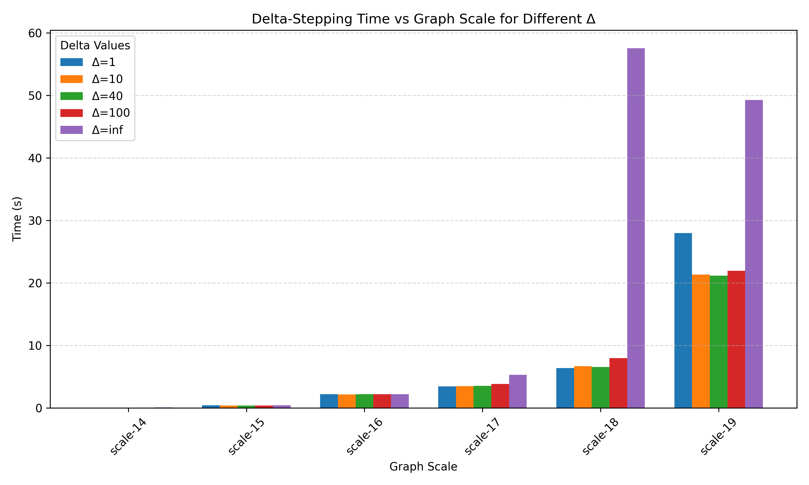{#fig:myfig width=100% style="display:block; margin-left:auto; margin-right:auto;"}
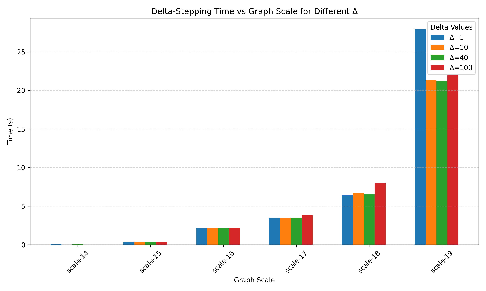{#fig:myfig width=100% style="display:block; margin-left:auto; margin-right:auto;"}
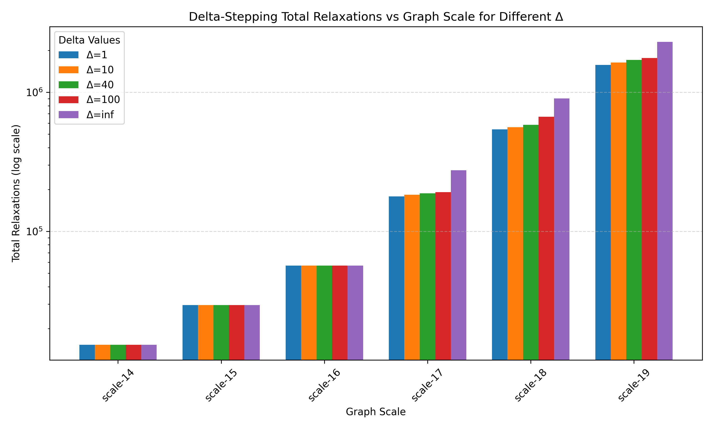{#fig:myfig width=100% style="display:block; margin-left:auto; margin-right:auto;"}
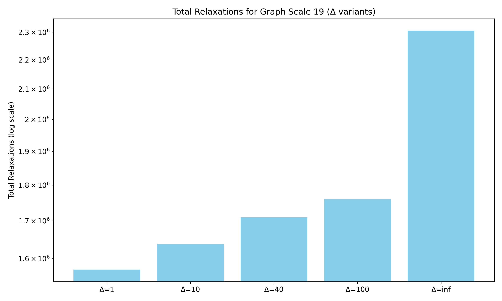{#fig:myfig width=100% style="display:block; margin-left:auto; margin-right:auto;"}

# Peformance of baseline
The baseline is rather slow and takes huge time for scales 20 and above
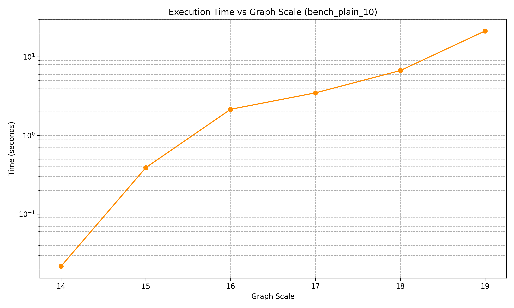

# Optimization: IOS
We implemented the IOS optimization from the paper.  
It has a major impact on performance.

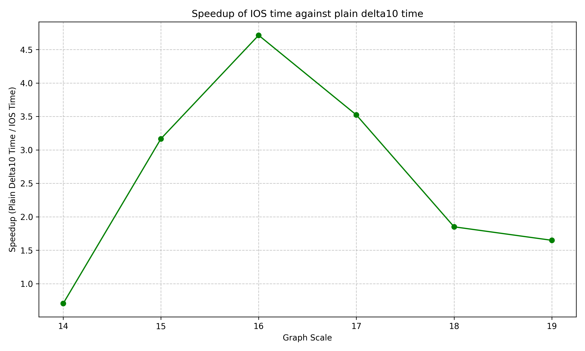

# Optimization: Hybridization
We implemented the hybridization optimization from the paper.  
It provides a significant speedup—up to 1.5× on medium-scale graphs—then levels off.

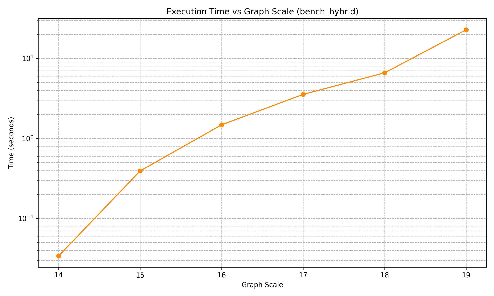  
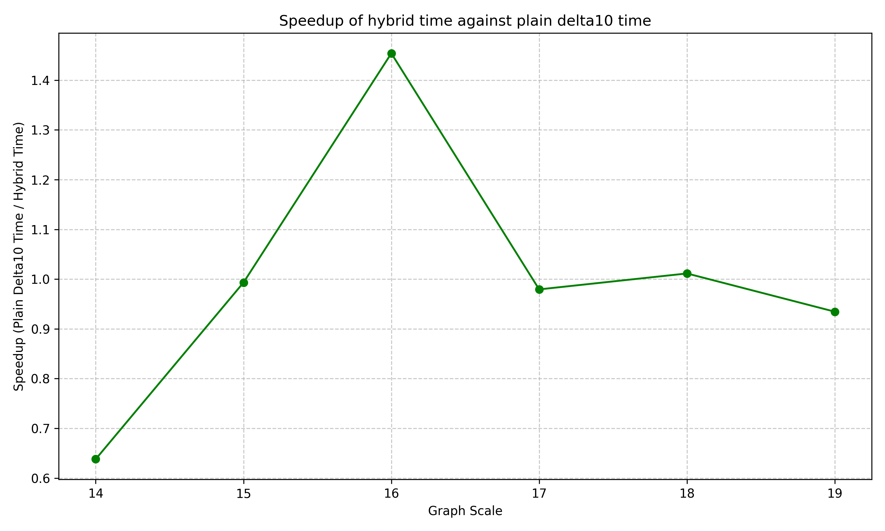

# Optimization: IOS + Hybridization combined
Most of the performance benefit of the combined optimizations come from the IOS optimization.
Below we can see the speedup graph for it:
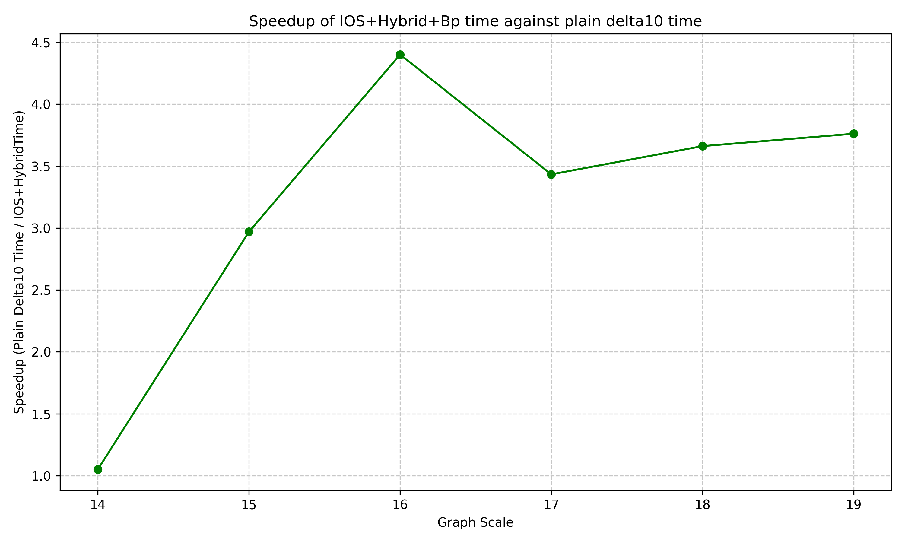

# Scaling: strong scaling for scale = 19
To establish the optimal workload for a single node, we examine strong scaling, testing graph
of scale 19 (~0.5M vertices) and number of processes: [48, 96, 192, 384]

# Scaling:
We analyze weak scaling of the optimized solution against the unoptimized (baseline) delta-stepping
algorithm. Scaling is not the best - our hypothesis is that due to the nature of the graphs studied,
the number of MPI one-sided communication messages is very unbalanced. This leads to huge wait times
at the barrier after the relaxation step. This has been verified experimentally and has not been observed
on more regular graphs.
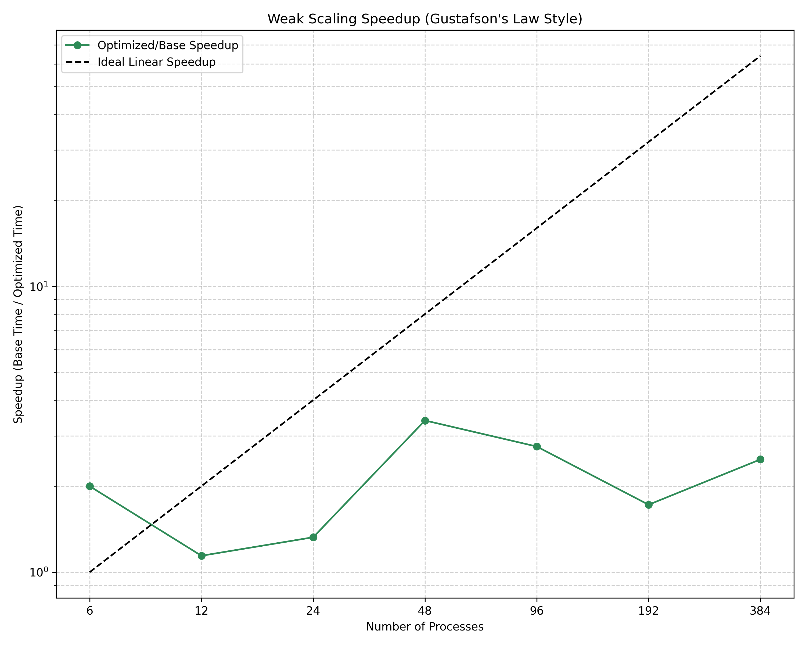

# Custom optimizations tried: Local bypass
When testing on large cycles, we noticed that the progam would benefit from
being able to add a new vertex to the currently processed bucket, if it is its owner
and it has just been relaxed from a higher bucket to a lower bucket. This optimization
rather cancels-out with IOS optimization, but was examined by us as the first one.
As the impact on performance for larger scales was not obvious, we decided to disable it by default.
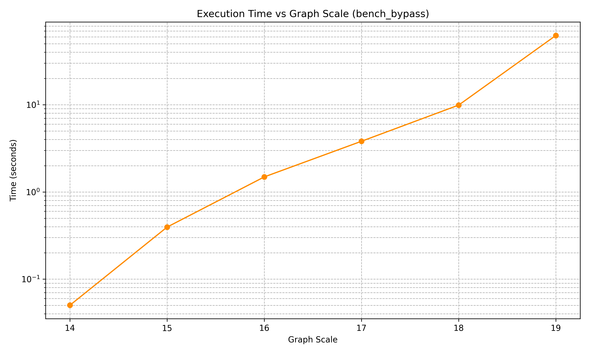
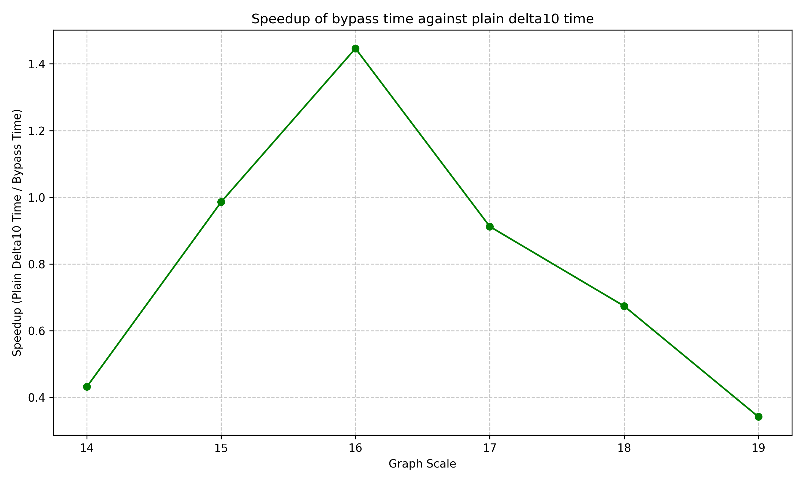

